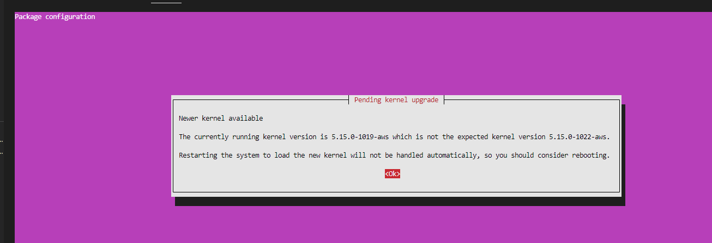
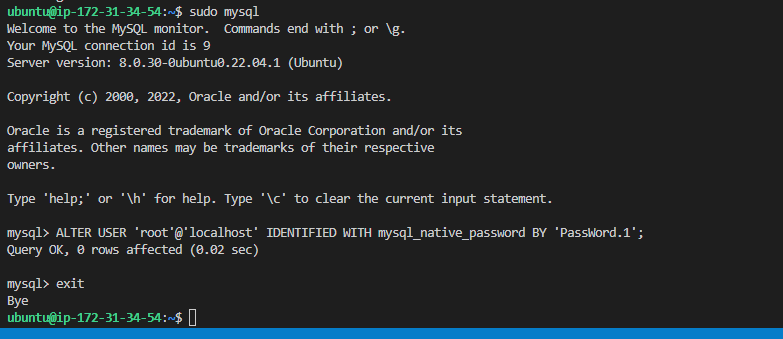

# LEMP STACK IMPLEMENTATION

## INSTALLING NGNIX WEB SERVER

`sudo apt update`

`sudo apt upgrade`

`sudo apt install nginx`

`sudo systemctl status nginx`

OPEN TCP P0RT 80

`curl http://35.180.156.219`

[public ip address](http://35.180.156.219)

`curl -s http://35.180.156.219/latest/meta-data/public-ipv4`

### INSTALLING MYSQL

`sudo apt install mysql-server`

`sudo mysql`

`sudo mysql_secure_installation`

`sudo mysql -p`

INSTALLING PHP

`sudo apt install php-fpm php-mysql`

CONFIGURING NGINX TO USE PHP PROCESSOR

`sudo mkdir /var/www/projectLEMP`

`sudo chown -R $USER:$USER /var/www/projectLEMP`

`sudo nano /etc/nginx/sites-available/projectLEMP`

input nano code

#/etc/nginx/sites-available/projectLEMP

server {
    listen 80;
    server_name projectLEMP www.projectLEMP;
    root /var/www/projectLEMP;

    index index.html index.htm index.php;

    location / {
        try_files $uri $uri/ =404;
    }

    location ~ \.php$ {
        include snippets/fastcgi-php.conf;
        fastcgi_pass unix:/var/run/php/php8.1-fpm.sock;
     }

    location ~ /\.ht {
        deny all;
    }

}

`sudo ln -s /etc/nginx/sites-available/projectLEMP /etc/nginx/sites-enabled/`

`sudo nginx -t`

`sudo unlink /etc/nginx/sites_enabled/default`

`sudo systemctl reload nginx`

`sudo echo 'Hello LEMP from hostname' $(curl -s http://35.180.156.219/latest/meta-data/public-hostname) 'with public IP' $(curl -s http://35.180.156.219latest/meta-data/public-ipv4) > /var/www/projectLEMP/index.html`

[website url](http://35.180.156.219/)

ec2-35-180-156-219.eu-west-3.compute.amazonaws.com

TESTING PHP WITH NGINX

`sudo nano /var/www/projectLEMP/info.php`

<?php
phpinfo();

[ip/info.php](http://35.180.156.219/info.php)

`sudo rm /var/www/projectLEMP/info.php`

RETRIEVING DATA FROM MYSQL DATABASE WITH PHP

`sudo mysql -p`

` 'create database example_database;`

`show databases;`

`CREATE USER example_user @ IDENTIFIED WITH mysql_native_password BY 'HappyKonga@802';`

`GRANT ALL ON example_database.* TO example_user @;`

1[granting permissions to created used named example_user](./images/retrieving_data_from_mysqlDatabase_using_php/granting_permissions_to_example_user.PNG)

`exit`

`mysql -u example_user -p`

`SHOW DATABASES;`

CREATE TABLE example_database.todo_list(
    -> item_id INT AUTO_INCREMENT,
    -> content VARCHAR(255),
    -> PRIMARY KEY(item_id));

mysql>  INSERT INTO example_database.todo_list (content) VALUE("My first important item");

mysql> INSERT INTO example_database.todo_list (content) VALUE("My second important item");

mysql> INSERT INTO example_database.todo_list (content) VALUE("My third important item");

mysql> INSERT INTO example_database.todo_list (content) VALUE("Visit the dentist");

mysql> INSERT INTO example_database.todo_list (content) VALUE("Study for at least 6 hours daily");

SELECT * FROM example_database.todo_list;

mysql> exit

`nano /var/www/projectLEMP/todo_list.php`

Input nano script

<?php
$user = "example_user";
$password = "password";
$database = "example_database";
$table = "todo_list";

try {
  $db = new PDO("mysql:host=localhost;dbname=$database", $user, $password);
  echo "<h2>TODO</h2><ol>";
  foreach($db->query("SELECT content FROM $table") as $row) {
    echo "<li>" . $row['content'] . "</li>";
  }
  echo "</ol>";
} catch (PDOException $e) {
    print "Error!: " . $e->getMessage() . " ";
    die();
}

[testing access to webpage](http://35.180.156.219/todo_list.php)

END OF PROJECT

