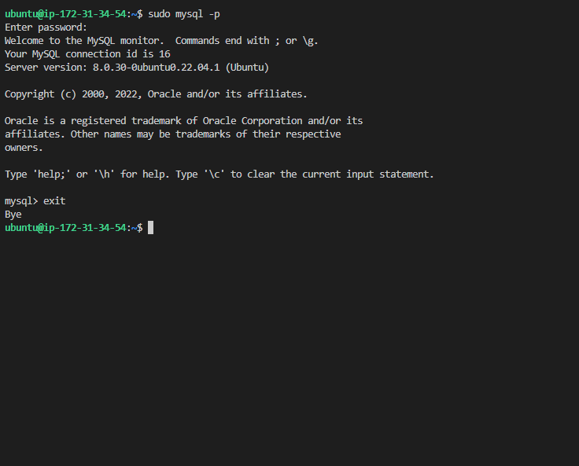

# LEMP STACK IMPLEMENTATION

## INSTALLING NGNIX WEB SERVER

`sudo apt update`

`sudo apt upgrade`

`sudo apt install nginx`

`sudo systemctl status nginx`

OPEN TCP P0RT 80

`curl http://35.180.156.219`

[public ip address](http://35.180.156.219)

`curl -s http://35.180.156.219/latest/meta-data/public-ipv4`

### INSTALLING MYSQL

`sudo apt install mysql-server`

`sudo mysql`

`sudo mysql_secure_installation`

`sudo mysql -p`

INSTALLING PHP

